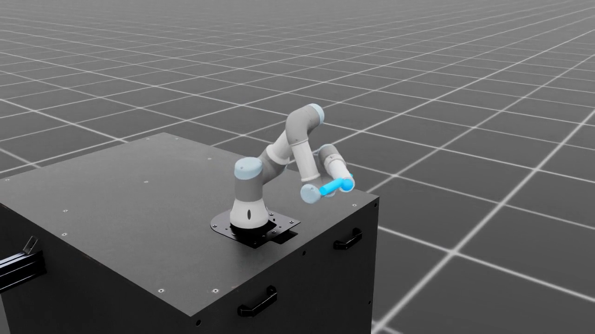

# When Does Learning Help a Manipulator on a Moving Base?

## An Empirical Decomposition

A reproducible Isaac Lab benchmark for comparing tuned model-based control and recurrent residual reinforcement learning under exogenous six-degree-of-freedom base motion.

This repository is a **code-only public artifact** for the experiments reported in the accompanying manuscript. Training data, checkpoints, TensorBoard events, evaluation dumps, internal logs, and paper working files are intentionally excluded.

[](media/moving_base_line_tracking.mp4)

[Watch or download the MP4](media/moving_base_line_tracking.mp4)

The video is a qualitative visualization of target-conditioned world-line tracking. It is not population evidence for the numerical results below; those conclusions use paired multi-seed evaluation.

## Research question

How much of an apparent learning advantage survives after the benchmark itself is controlled carefully?

The task uses a UR3 manipulator mounted on an externally moved platform. A project-owned cylinder extends `0.12 m` from the wrist link, and the center of its positive-Z end face is the tool center point (TCP). The command, observation, reward, evaluator, and renderer all use that same TCP. The target is a horizontal line fixed in the world frame rather than a goal that moves with the robot base.

The benchmark varies:

- exogenous 6-DoF base disturbance;
- measurement delay versus actuation delay;
- disturbance bandwidth;
- nominal, tuned, and per-condition resolved-rate baselines;
- recurrent residual PPO policies;
- training and evaluation seeds.

## Main result

Benchmark choices materially change the conclusion.

- A `100 ms` actuation delay increases cross-track p95 error by `1.73–2.46×`.
- The same measurement delay changes the metric by only `0.99–1.01×`.
- Residual learning appears to improve cell-wise p95 by about `47%` against the nominal gain-1.0 controller.
- The improvement falls to `34.9%` against the best shared tuned gain and `22.0%` against a per-condition gain-sweep comparator.
- The corresponding global cell-median p95 values are `7.06 mm` for the per-condition comparator and `6.71 mm` for the policy.
- The remaining advantage is bandwidth-dependent: the policy improves p95 by `26.6–45.6%` under the fastest disturbance, but is approximately tied with tuned control in two slow, high-delay cells.

The claim is deliberately narrow: this is a controlled, sim-to-real-relevant benchmark decomposition. It is not a real-robot transfer result, a hydrodynamic validation, or a claim that moving-base manipulation itself is new.

## Repository layout

```text
src/marine_manipulator/
  calibration.py        shared geometry and TCP constants
  controllers.py        analytic and coupled controller baselines
  evaluation.py         capture and post-capture tracking metrics
  hydrodynamics.py      free-floating diagnostic model
  trajectory.py         world-line command helpers
  ur3_kin.py            batched FK, Jacobian, and DLS IK
  uvms_asset.py         free-floating platform construction
  tasks/random_base_line/
    env_cfg.py          benchmark variants
    env.py              task-specific environment behavior
    mdp.py              command, observation, reward, and disturbance terms
    agents/             recurrent PPO configuration
scripts/                training, evaluation, rendering, sweeps, and reports
tests/                  contract and kinematics tests
media/                  one qualitative, GitHub-compatible demonstration
```

## Tested environment

The snapshot was exercised on the canonical experiment environment:

- NVIDIA Isaac Sim `5.1.0`
- NVIDIA Isaac Lab `2.3.2`
- Python `3.11`
- PyTorch `2.7.0+cu128`
- RSL-RL `5.0.1`

Isaac Sim, Isaac Lab, GPU drivers, and checkpoints are not bundled in this repository.

## Setup

Clone this repository beside an existing Isaac Lab installation, then point the launchers at it:

```bash
export ISAACLAB_DIR="$HOME/00_dev/02-isaacsim/robot-poc/IsaacLab"
export MARINE_PROJECT_DIR="$PWD"
```

The shell wrappers add the project and Isaac Lab source packages to `PYTHONPATH` and run through `isaaclab.sh`.

## Fast checks

Run the dependency-light syntax gate:

```bash
python3 -m compileall -q src scripts tests
```

Run the dependency-light tests through the Isaac Lab interpreter:

```bash
PYTHONPATH=src "$ISAACLAB_DIR/isaaclab.sh" -p -m pytest -q \
  tests/test_motion_config.py \
  tests/test_ur3_kin.py \
  tests/test_precision_start_trajectory.py
```

The four configuration-contract modules import Isaac/`pxr` state, so launch each through its AppLauncher wrapper rather than collecting them directly with pytest:

```bash
for runner in \
  tests/run_random_base_line_contract.py \
  tests/run_precision_start_contract.py \
  tests/run_precision_far_immediate_contract.py \
  tests/run_target_conditioned_contract.py; do
  scripts/run_py.sh "$runner"
done
```

Run the runtime gate:

```bash
scripts/run_py.sh scripts/verify_fresh_runtime.py --device cuda:0
```

## Training

A one-iteration checkpoint smoke for the residual-delay task:

```bash
scripts/train.sh \
  --task Marine-UR3-ResidualIkDelay-v0 \
  --num-envs 16 \
  --max-iterations 1 \
  --seed 970 \
  --run-name residual_smoke
```

Long runs should use an explicit run name and record the source revision. The output directory is ignored by Git.

## Evaluation

Evaluate a policy checkpoint:

```bash
scripts/evaluate.sh \
  --controller policy \
  --checkpoint /path/to/model.pt \
  --task Marine-UR3-ResidualIkDelay-Play-v0 \
  --num-envs 4096 \
  --steps 600 \
  --seed 44 \
  --run-name residual_eval_seed44
```

Evaluate the analytic baseline under the same task contract:

```bash
scripts/evaluate.sh \
  --controller ik \
  --task Marine-UR3-ResidualIkDelay-Play-v0 \
  --num-envs 4096 \
  --steps 600 \
  --seed 44 \
  --run-name ik_eval_seed44
```

Do not compare only the final checkpoint. `scripts/best_checkpoint.py` selects from the training curve, and `scripts/evaluate.py` separates initial capture from post-capture tracking. The headline metric is post-capture cross-track p95, not whole-rollout average error.

## Data policy

This snapshot does not include:

- training checkpoints or optimizer state;
- TensorBoard event files;
- raw evaluation summaries or trajectory arrays;
- logs and detached-run output;
- collected third-party papers or redistributable assets;
- private research notes or manuscript working files.

The exact export provenance is recorded in [`SNAPSHOT.md`](SNAPSHOT.md). File hashes are recorded in `MANIFEST.sha256`.
